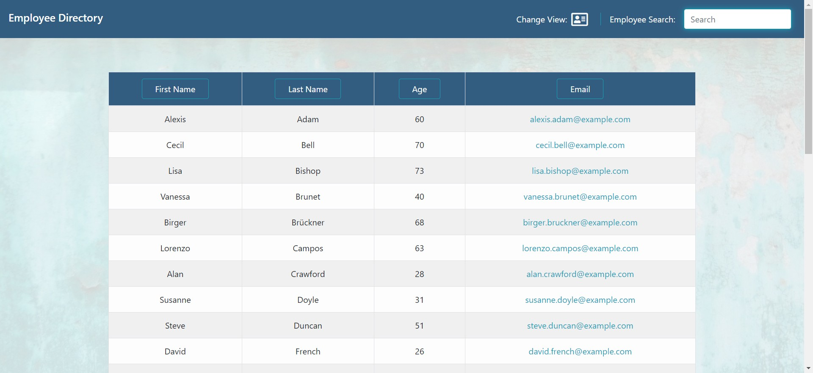
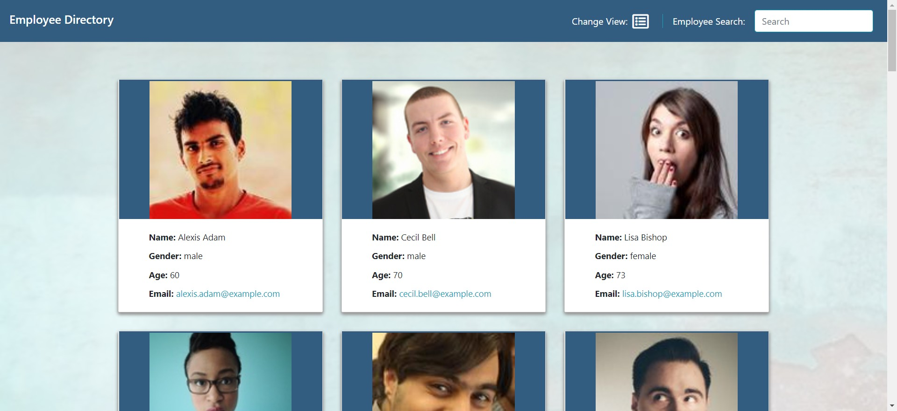
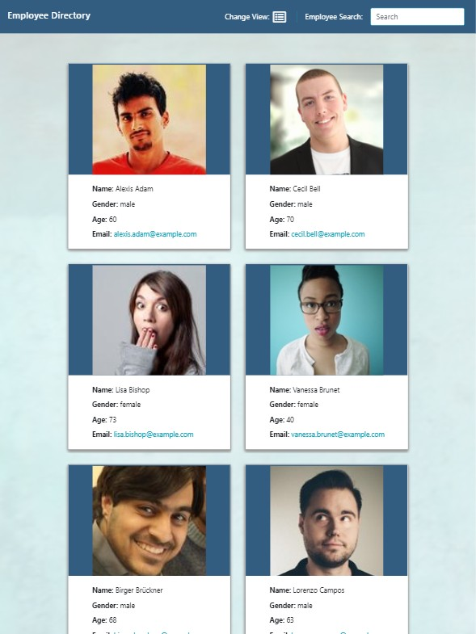
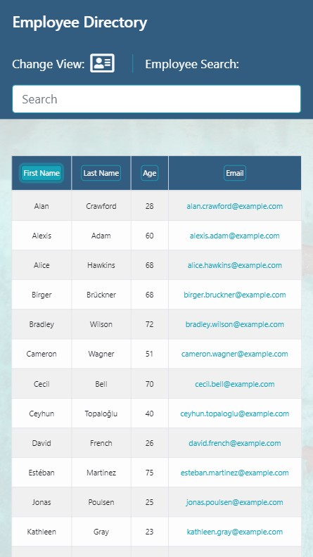

# employee-directory
 
  

## Table of Contents

* [User Story](#user-story)
* [Installation](#installation)
* [Usage](#usage)
* [Screenshots](#screenshots)
* [Built With](#built-with)

## User Story
As a user, I want to be able to view my entire employee directory at once so that I have quick access to their information.  I would like to be able to order the employees by name, age, or email and would like to be able to filter the employees using a search box.
* To check out my app on Heroku go here:  https://alexcoulter.github.io/employee-directory/

## Installation

 * Clone this repository from Github from the command line by typing:  
   `git clone https://github.com/alexcoulter/employee-directory.git`
  * Navigate to the 'fitness-time' folder by typing:  
  `cd employee-directory` 
  * Install dependencies by typing:  
   `npm install`
  * Run this application by typing:   
  `node server` 
  * Open this application in your browser by typing the url:
  `http://localhost:3000/`

  ## Usage
When you open this app your 30 employees are loaded from the *randomuser.me* api.  To put the employees in order by the categories listed, simply press the button of said category in the heading of the list.  If you want to order the employees by *`Last Name`* simply press the button on the top of ther list that says *`Last Name`*.  Press it again and the employees will be in descending alphabetical order.  To filter employees by a search word, just type it in the search box in the top-right corner of the page.  Only employees that have the searched characters in their first or last name will remain.  To switch from *`List View`* to *`Card View`* or back, click the icon next to *`Change View`* in the header. This will allow you to see the employees in seperate cards with their pictures and information. 
  
  ## Screenshots
* List View Screenshot

* Card View Screenshot

* Ipad Screenshot

* Iphone Screenshot

   

   ## Built With  

* **React** - One of the most powerfull, popular Javascript libraries. Used for creating interactive UI.
